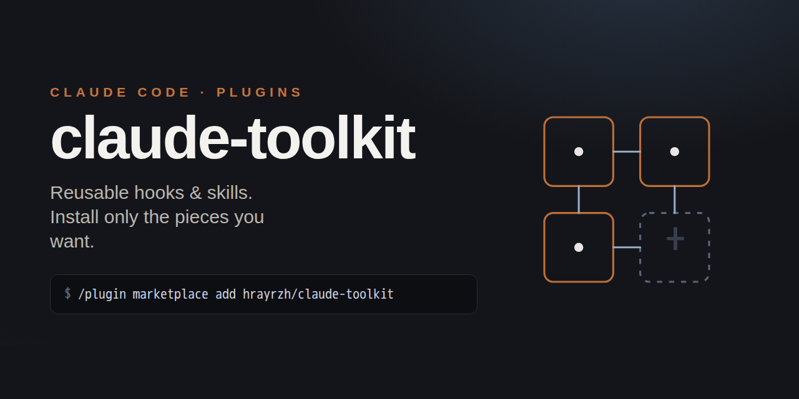

# claude-toolkit

A Claude Code **plugin marketplace** — reusable hooks and skills. Install only the
pieces you want; each is a separate plugin.

## Install (one command per piece)

Add the marketplace once:

```
/plugin marketplace add hrayrzh/claude-toolkit
```

Then install any subset — one, two, or all:

```
/plugin install auto-approve-permissions@claude-toolkit
```

Each plugin installs its own hooks/skills and can be enabled/disabled independently.
Nothing is forced — someone who wants only the hook installs only that; someone who
wants two skills installs those two.

## Plugins

| Plugin | What it does |
|---|---|
| [`auto-approve-permissions`](plugins/auto-approve-permissions/) | `PreToolUse` hook — auto-approve read-only / inspection Bash commands (and WebSearch/WebFetch); still prompt for writes, deletes, mutations, external-API calls. |
| [`house-modeler`](plugins/house-modeler/) | Skill — digitize floor plans (hand-drawn / photos) into accurate 2D SVG plans + an interactive walkable 3D model (Three.js) from one source of truth. Walls/doors/windows, areas, furniture clearances, plot, levels, sun-by-latitude, roofs; friendly interview for non-coders. |
| _(more skills/hooks land here)_ | each as its own plugin in `plugins/<name>/` |

## Layout

```
claude-toolkit/
├── .claude-plugin/
│   └── marketplace.json          # lists every plugin (relative ./plugins/<name> sources)
└── plugins/
    └── <name>/
        ├── .claude-plugin/plugin.json   # plugin manifest
        ├── hooks/hooks.json             # (hook plugins) — uses ${CLAUDE_PLUGIN_ROOT}
        ├── hooks/<script>               # (hook plugins)
        ├── skills/<name>/SKILL.md       # (skill plugins)
        └── README.md
```

**One repo, many plugins** — not a repo per skill. Adding a new skill/hook = a new
folder under `plugins/` + one entry in `marketplace.json`. This is how the official
`anthropics` marketplaces are organized.

## Manual install (without the plugin system)

Each plugin folder is self-contained — you can also copy its `hooks/` script into
`~/.claude/hooks/` (global) or `<project>/.claude/hooks/` (per-project) and register
it in the matching `settings.json`. See the plugin's own README.
