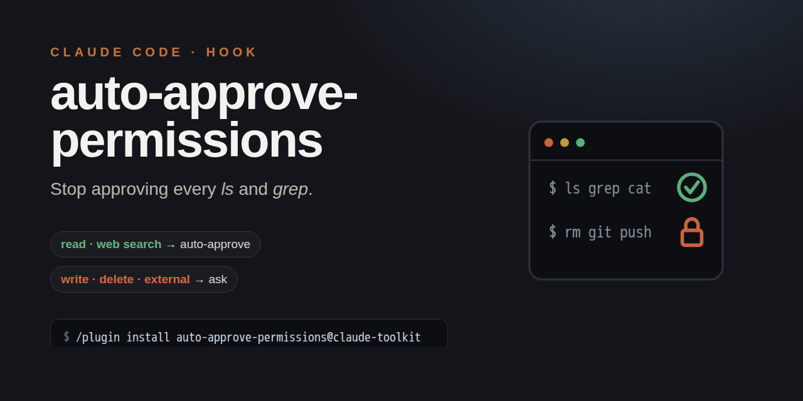

# Claude Code — auto-approve read-only, ask for writes

> Looking for: how to stop Claude Code asking permission for every command, fewer
> permission prompts, auto-approve read-only / safe commands, skip approval for
> `ls`/`grep`/`cat` while still confirming writes. This hook does that.

How I configured Claude Code so that **read-only / inspection commands run without a permission prompt**, while **anything that writes, deletes, modifies, or calls an external service still asks**. Drop-in reproducible — copy the hook + settings below.

## The principle

> If an action leaves a trace in the real world after the session closes (writes a file, mutates state, hits an external API, git push, sends something) → **ask**.
> If it only reads / lists / checks / searches locally (or web search/fetch) → **auto-approve**.

## How it works

Claude Code fires a **`PreToolUse` hook** before every tool call. The hook reads the tool name + input on stdin and may print `{"decision":"approve"}` to skip the permission prompt. Printing nothing → normal prompt. So a small Python script classifies each Bash command and only auto-approves the safe ones.

- `WebSearch` / `WebFetch` → always approved.
- `Bash` → approved **only if** the command matches no "unsafe" pattern and has no file-write redirect / heredoc.
- Every other tool (Edit, Write, etc.) → left to the normal permission flow (always asks).

> Note: Claude Code reads `settings.json` and hooks **at session start** — after editing, restart the session for changes to take effect. (The hook *script* itself is re-read each call, so logic tweaks are live; only registering/unregistering the hook needs a restart.)

## 1. The hook — `~/.claude/hooks/auto-approve-readonly.py` (chmod +x)

```python
#!/usr/bin/env python3
"""
PreToolUse hook — auto-approve read-only operations.
Write / delete / modify / external-API commands still require user permission.
"""
import sys, json, re

data = json.load(sys.stdin)
tool_name = data.get("tool_name", "")
tool_input = data.get("tool_input", {})

# --- Web research tools: always approve ---
if tool_name in ("WebSearch", "WebFetch"):
    print(json.dumps({"decision": "approve"}))
    sys.exit(0)

if tool_name != "Bash":
    sys.exit(0)  # other tools: normal permission flow

command = tool_input.get("command", "")

# --- Specific pre-approved scripts (optional allow-list by path) ---
if re.search(r'\bpython3?\s+/home/USER/\.claude/transcribe_voice\.py\b', command):
    print(json.dumps({"decision": "approve"}))
    sys.exit(0)

# --- Patterns that indicate write / modify / delete / launch → DON'T auto-approve ---
UNSAFE = [
    # File system mutations
    r'\brm\s', r'\brmdir\b', r'\bchmod\b', r'\bchown\b', r'\bdd\b\s',
    r'\bmv\b', r'\bcp\b', r'\btouch\b', r'\bmkdir\b', r'\bln\s',
    # Process control
    r'\bsudo\b', r'\bkill\b', r'\bpkill\b', r'\bfuser\b.*-k',
    r'\bnohup\b', r'\bsetsid\b', r'\s&\s*$',
    # Service management
    r'\bsystemctl\b.+\b(start|stop|restart|reload|enable|disable|mask|unmask)\b',
    # Git write operations
    r'\bgit\b.+\b(commit|push|fetch|pull|merge|rebase|reset|add|stash|restore|switch|tag)\b',
    r'\bgit\b.*branch\s+-',
    # Package managers
    r'\bpip3?\s+(install|uninstall|download)\b',
    r'\bnpm\s+(install|uninstall|ci|update)\b',
    r'\bapt(-get)?\s+(install|remove|purge|autoremove|upgrade)\b',
    r'\bbun\s+(install|add|remove|upgrade)\b',
    # curl / wget write calls — [^;|&]* so the match can't cross a shell
    # separator into another command (e.g. `tr -d` after a pipe is NOT curl -d)
    r'\bcurl\b[^;|&]*\s(-X\s*(POST|PUT|DELETE|PATCH)|--request\s+(POST|PUT|DELETE|PATCH)|--data\b|-d\s+|-F\s+|--upload-file)',
    r'\bwget\b[^;|&]*\s-[Oo]\s',
    # Running scripts (can do anything)
    r'\bpython3?\s+\S+\.py\b',
    r'\bnode\b\s+\S+\.js\b',
    # python3 -c with dangerous operations
    r"\bpython3?\s+-c\b.*\bopen\s*\(.*['\"]w",
    r'\bpython3?\s+-c\b.*\bos\.(remove|unlink|rmdir|makedirs|mkdir)\b',
    r'\bpython3?\s+-c\b.*\bsubprocess\b',
    r'\bpython3?\s+-c\b.*\bshutil\b',
    r'\bpython3?\s+-c\b.*\burllib\.request\b',
    r'\bpython3?\s+-c\b.*\brequests\.(get|post|put|delete|patch)\b',
    # SQLite mutations
    r'\bsqlite3\b.*\b(INSERT|UPDATE|DELETE|DROP|CREATE|ALTER|REPLACE)\b',
]


def has_file_write(cmd):
    """Redirect to a real file (not /dev/null or /tmp)."""
    # Strip string-literal contents first so a `>` inside a regex/string
    # (e.g. python3 -c "re.search(r'[^>]+>', ...)") doesn't false-positive.
    s = re.sub(r'"(?:[^"\\]|\\.)*"', '""', cmd)
    s = re.sub(r"'(?:[^'\\]|\\.)*'", "''", s)
    s = re.sub(r'\d?>>?\s*/dev/null', '', s)
    s = re.sub(r'>>\s*/tmp/\S+', '', s)
    s = re.sub(r'>\s*/tmp/\S+', '', s)
    return bool(re.search(r'(?<![<&2])[>](?![>=])', s))


def has_heredoc(cmd):
    return bool(re.search(r"<<\s*['\"]?EOF", cmd, re.IGNORECASE))


def is_unsafe(cmd):
    for pattern in UNSAFE:
        if re.search(pattern, cmd, re.IGNORECASE):
            return True
    return has_file_write(cmd) or has_heredoc(cmd)


if not is_unsafe(command):
    print(json.dumps({"decision": "approve"}))
```

## 2. Register it — `~/.claude/settings.json`

```json
{
  "permissions": {
    "allow": [
      "Bash(python3 /home/USER/.claude/transcribe_voice.py*)"
    ]
  },
  "hooks": {
    "PreToolUse": [
      { "hooks": [ { "type": "command", "command": "/home/USER/.claude/hooks/auto-approve-readonly.py" } ] }
    ]
  }
}
```

- `permissions.allow` — точечные исключения, всегда без спроса (конкретные доверенные скрипты по пути).
- `hooks.PreToolUse` — указывает на хук (полный путь, `chmod +x`).
- Per-project вместо глобального: положи те же файлы в `<project>/.claude/` (или `settings.local.json` + `.gitignore`), путь к хуку — `$CLAUDE_PROJECT_DIR/.claude/hooks/auto-approve-readonly.py`. Запускай Claude из папки проекта.

## 3. Design notes / gotchas

- **Default-deny for Bash:** approve only when *no* unsafe pattern matches. New/unknown commands that look writy stay gated.
- **`> /tmp` and `> /dev/null` allowed:** редиректы во временное/в никуда считаются безопасными; запись в реальные файлы — нет.
- **String-literal stripping in `has_file_write`:** иначе `>` внутри regex (`grep -oE '<tag>'`, `python3 -c "...r'[^>]+>'..."`) ложно читался как запись файла. Вырезаем содержимое кавычек перед проверкой.
- **`[^;|&]*` в curl/wget правилах:** чтобы матч «curl … -d» не перепрыгивал через пайп на соседнюю команду (классика: `curl … | tr -d '\r'` — здесь `-d` это флаг `tr`, не данные curl).
- **Running `.py`/`.js` is treated unsafe** (скрипт может сделать что угодно) — кроме явно разрешённых в allow-list.
- **Edit / Write tools НЕ трогаем** — они всегда идут через обычный запрос разрешения.

## 4. Verify

```bash
echo '{"tool_name":"Bash","tool_input":{"command":"ls -la /tmp"}}'        | ~/.claude/hooks/auto-approve-readonly.py   # → {"decision":"approve"}
echo '{"tool_name":"Bash","tool_input":{"command":"rm -rf /tmp/x"}}'      | ~/.claude/hooks/auto-approve-readonly.py   # → (empty = will prompt)
echo '{"tool_name":"Bash","tool_input":{"command":"curl -s site | tr -d x"}}' | ~/.claude/hooks/auto-approve-readonly.py  # → approve
echo '{"tool_name":"Bash","tool_input":{"command":"curl -X POST site -d a=1"}}' | ~/.claude/hooks/auto-approve-readonly.py  # → (empty = prompt)
```

Replace `USER` with the actual username. Restart the Claude session after installing.
