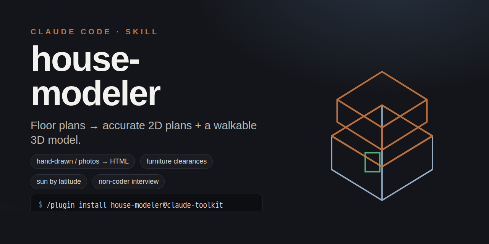

# house-modeler

A Claude Code **skill** that digitizes a building from hand-drawn or photographed
floor plans into **both** accurate 2D floor plans (SVG) and an interactive,
walkable **3D model** (Three.js) — generated from a single source of truth:
geometry arrays in millimetres.

## What it does

- **2D + 3D from one source** — walls, doors, windows laid out once (mm), rendered as
  SVG plans and a Three.js model.
- **Interior furnishing** to professional clearance standards; **area calculation**.
- **Site / plot, levels** (raised floor, ramps, stairs, terrace, balcony).
- **Physically-correct sun** by latitude; **pitched roofs**.
- **Friendly interview** for non-technical users — building type, floors, rooms,
  orientation — no need to say "Three.js" or "3D".

Triggers on things like "digitize this house", "model my apartment", "make a plan
from these photos", "show what it would look like".

## Install

```
/plugin marketplace add hrayrzh/claude-toolkit
/plugin install house-modeler@claude-toolkit
```

## Structure

```
house-modeler/
├── SKILL.md
└── references/
    ├── intake-interview.md
    ├── geometry-capture.md
    ├── conventions.md
    ├── 2d-plans.md
    ├── 3d-threejs.md
    ├── interior-and-area.md
    └── verification.md
```
